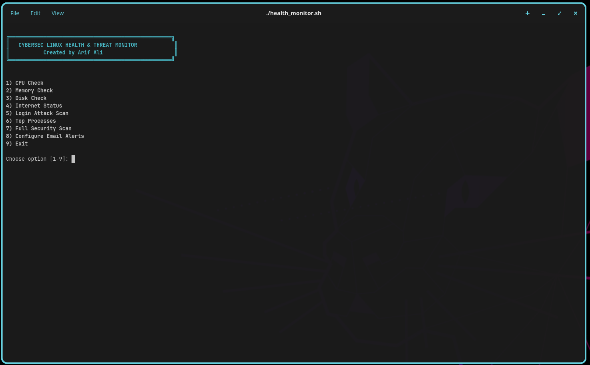
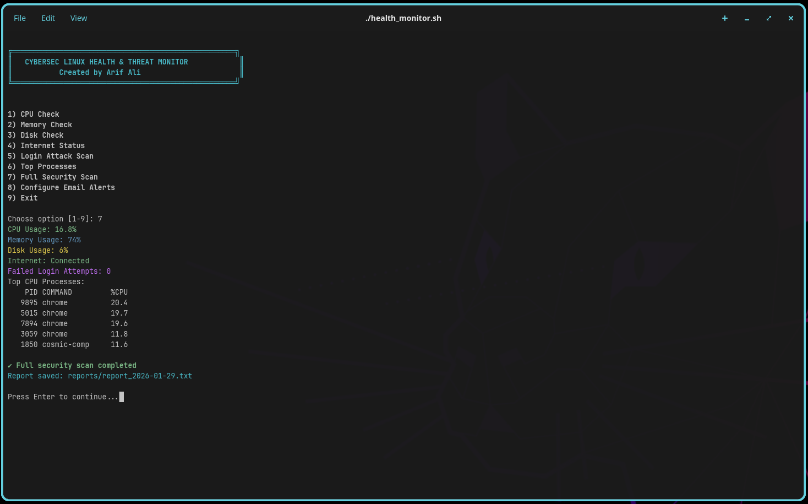

---

# 🛡️ CyberSecMon — Personal Linux Security Monitoring Tool

<p align="center">
  <code>
    <span style="color:#00ff00; font-family:monospace; font-size:24px;">  ____ _   _ ____  ____ ____ ___ ____  __  __ ___ _   _ </span><br>
    <span style="color:#00ffff; font-family:monospace; font-size:24px;"> / ___| | | / ___||  _ \ ___|_ _|  _ \|  \/  |_ _| \ | |</span><br>
    <span style="color:#ff00ff; font-family:monospace; font-size:24px;">| |   | | | \___ \| | | |__  | || | | | |\/| || ||  \| |</span><br>
    <span style="color:#ffff00; font-family:monospace; font-size:24px;">| |___| |_| |___) | |_| |___| | || |_| | |  | || || |\  |</span><br>
    <span style="color:#ff6600; font-family:monospace; font-size:24px;"> \____|\___/|____/|____/    |___|____/|_|  |_|___|_| \_|</span><br>
  </code>
  <br>
  <span style="color:#00ff00; font-family:monospace; font-size:18px;">Linux Security Monitoring Tool</span>
</p>


<p align="center">
  <strong>Automated, Safe, and Professional Cybersecurity Monitoring for Linux</strong>
</p>

<p align="center">
  <a href="https://github.com/ArifAli8866/CyberSecMon/actions/workflows/ci.yml?branch=main"></a>
  <a href="https://github.com/ArifAli8866/CyberSecMon/releases"></a>
  <a href="LICENSE"></a>
  <a href="https://linkedin.com/in/arif-ali-23a38032a"></a>
</p>

**CyberSecMon** is a *menu-driven Linux cybersecurity monitoring tool* designed for both beginners and professionals.
It provides threshold monitoring, animated dashboards, email alerts, and full system status tracking — all safe to host publicly on GitHub.

---

## Features

* ✅ **Automatic tools setup** (mail, acpi, etc.)
* ✅ **No hard-coded emails** — configure per user
* ✅ **Real-time cybersecurity-style monitoring**
* ✅ **Animated loading screens for status updates**
* ✅ **Threshold alerts for CPU, RAM, disk, and network usage**
* ✅ **Automated email alerts when thresholds exceeded**
* ✅ **Menu-driven, easy-to-use interface**
* ✅ **Safe to share on public GitHub repo**
* ✅ **Author credit clearly displayed**

---

## Installation (Recommended)

**Linux (Ubuntu/Debian/Fedora compatible):**

```bash
git clone https://github.com/ArifAli8866/CyberSecMon.git
cd CyberSecMon
chmod +x install.sh
./install.sh
```

The installer sets up all required tools, dependencies, and configurations automatically.

---

## Quick Start

Run the main menu:

```bash
sudo ./cybersecmon.sh
```

* Choose the monitoring type: CPU, RAM, Disk, Network, or Full System.
* Set thresholds for alerts.
* Configure your email to receive notifications.
* Watch the live animated status dashboard.

---

## How It Works (Diagram)
```
┌───────────────────────┐
│       CyberSecMon      │
│   Menu-Driven CLI      │
├─────────────┬─────────┤
│ CPU Monitor │ RAM Monitor
│ Disk Monitor│ Network Monitor
│ Threshold   │ Email Alerts
└─────────────┴─────────┘
         │
         ▼
     Real-Time Alerts
```

---

## Screenshots

<p align="center">
  
  
  
</p>

*(Replace with your own screenshots or live dashboard captures)*

---

## Configuration

1. Open `config.sh` to set your email and thresholds.
2. CPU, RAM, Disk, and Network limits can be customized.
3. Email alerts require `mailutils` or `sendmail`.

```bash
EMAIL="your.email@example.com"
CPU_THRESHOLD=85
RAM_THRESHOLD=90
DISK_THRESHOLD=80
NETWORK_THRESHOLD=1000  # MB/s
```

---

## License

This project is licensed under the **MIT License** — see [LICENSE](LICENSE) for details.

---

## Follow & Support

<p align="center">
  <a href="https://linkedin.com/in/arif-ali-23a38032a"></a>
  <a href="https://github.com/ArifAli8866"></a>
</p>

